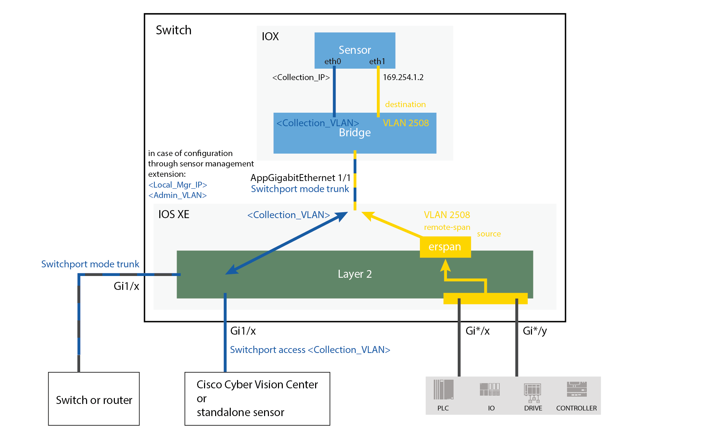

[](https://developer.cisco.com/codeexchange/github/repo/CiscoDevNet/cisco-cyber-vision-sensor-management-ansible)

# Cyber Vision Sensor Installation using Ansible Playbooks

## License

This project is licensed under the Cisco Sample Code License 1.1 - see the [LICENSE.md](LICENSE.md) file for details

## Overview

This repository contains a collection of Ansible playbooks designed to automate the deployment and configuration of Cisco Cyber Vision sensors across a variety of Cisco network devices (switches and routers) at scale.  Cisco Cyber Vision provides visibility into your industrial control system (ICS) to ensure security, continuity, and resilience of operations. The Ansible Playbooks also configure the networking device with the appropriate configuration needed to support the deployment of the Cyber Vision sensor.

Playbooks are provided for the following Cyber Vison sensor deployment methods:
* Using the IOx CAF APIs
* Using the IOS-XE CLI

The playbooks also support depolying the Cyber Vision sensor in the following modes:
* Standard Mode
* Active Discovery Mode

More on Ansible can be found at [Ansible.com](https://www.ansible.com/).

More on Cisco Cyber Vision can be found at [Cisco.com](https://www.cisco.com/site/us/en/products/security/industrial-security/cyber-vision/index.html#tabs-7edb32179e-item-d43da2dc1e-tab).

Guides for manual installation of the Cyber Vision sensor can be found at [Cisco.com](https://www.cisco.com/c/en/us/support/security/cyber-vision/products-installation-guides-list.html).

### Notice about Legacy Playbooks

For users who require access to the legacy playbooks, they are maintained in the `legacy/` directory within this repository. These playbooks are retained for historical purposes and are not actively maintained or updated. We recommend using the new playbooks for the most recent features, improvements, and security updates.

---
### Supported Devices

Current playbooks support deployment of Cyber Vision sensors on the following devices:

#### Switches- IE3300-10G, IE3400, IE9320, and Catalyst 9300

*Cyber Vision sensor architecture for IE3300, IE3400, IE9320, and Catalyst 9300 switches*

#### IR1101 and IR1833 Integrated Service Routers

*Cyber Vision sensor architecture for IR1101 and IR1833 integrated service routers*

#### IR8340 Integrated Services Routers

*Cyber Vision sensor architecture for IR8340 integrated service routers*

#### IC3000 Industrial Compute Gateway

*Cyber Vision sensor architecture for IC3000 industrial compute gateway*

### Sensor Active Discovery
Active Discovery can be configured on the following devices:

#### Switches- IE3300-10G, IE3400, IE9320, and Catalyst 9300

*Cyber Vision sensor architecture with Active Discovery enabled for IE3300, IE3400, IE9320, and Catalyst 9300 switches*

#### IR8340 Integrated Services Routers

*Cyber Vision sensor architecture with Active Discovery enabled for IR8340 integrated service routers*

#### IC3000 Industrial Compute Gateway

*Cyber Vision sensor architecture with Active Discovery enabled for IC3000 industrial compute gateway*

---
### Ansible Terms and Definitions

Ansible is an open-source automation tool that can be used for software provisioning, configuration management, and application-deployment, among other functions. The relationship between the various components of Ansible used in this project is as follows:

- Ansible Controller: This is the machine where Ansible is installed and from which all tasks and playbooks will be run. It is the central point from which we will manage nodes and execute commands.

- Nodes: Also known as "managed hosts," these are the network devices on which the Cyber Vision sensors will be installed and configured. The nodes are controlled by the Ansible Controller over SSH by default.

- Inventory: A file or collection of files that list all the nodes managed by Ansible. It can be organized into groups and can include variables that provide details about the hosts. These can be written in INI or YAML format.  More on [building inventories](https://docs.ansible.com/ansible/latest/inventory_guide/index.html).

- Vars (Variables): Variables in Ansible are used to manage dynamic values that can be different for each host or group. They can be defined in various places, including in the inventory, in separate variable files, or directly in playbooks.  In these examples you will find `vars.yml` files that hold the variables for specific device types.

- Configurations: The `ansible.cfg` file allows the customization of various aspects of Ansible's behavior, including default module parameters, inventory locations, privilege escalation settings, logging, and more.

- Playbooks: Playbooks are the core files where Ansible's configuration, deployment, and orchestration activities are defined. They are written in YAML and include a list of tasks to be executed on the nodes.  These tasks use a combination of Modules and other raw commands that call the functions of the node the playbook is running against.  More on [Ansible Playbooks](https://docs.ansible.com/ansible/latest/playbook_guide/index.html).

- Modules: Modules are discrete units of code that can be used by playbooks to perform tasks such as installing packages, copying files, or executing commands.  More on [Ansible Modules](https://docs.ansible.com/ansible/latest/module_plugin_guide/index.html).

- Credentials: These are the necessary authentication details required for the Ansible Controller to log in and manage the nodes. Credentials should be protected and handled securely, often using Ansible Vault.  In this example, they are contained in the `secrets.yml` file, which was then encrypted using Vault.

- Vault: Ansible Vault is a feature that allows users to encrypt sensitive data such as passwords or keys. This ensures that credentials are securely managed and not exposed in plain text in playbooks or variable files. Playbooks can point to the Vault to grab these credentials, prompting the user for a password for authentication.  More on [Ansible Vault](https://docs.ansible.com/ansible/latest/cli/ansible-vault.html#) and [protecting sensitive data](https://docs.ansible.com/ansible/latest/vault_guide/index.html).

- Logging: **By default, Ansible logs are not enabled**, but can be configured by setting a log path in the `ansible.cfg` file. Verbose output from ansible playbook runs can be useful for troubleshooting and auditing purposes.  More on [logging output](https://docs.ansible.com/ansible/latest/reference_appendices/logging.html).

---
## Getting Started
Before running playbook automation to install the Cyber Vision sensor on your host devices, you must configure a system to act as your Ansible Controller.  This guide assumes the use of Debian based Linux system, but Ansible can be installed on other [specific operating systems](https://docs.ansible.com/ansible/latest/installation_guide/installation_distros.html)

### Prerequisites

Before you begin automating tasks with Ansible playbooks, ensure the following prerequisites are met:

1. Python:  Install Python (Version 3.X) on your Ansible Controller.  Python is required for Ansible and its modules to function properly.

2. Copy this repository to your Ansible controller.  This can be done with `git clone`, or by pushing the <span style="background-color: green"><> Code</span> button on this repo page and selecting `Download ZIP`.

3. Python Packages:  Install packages outlined in the `requirements.txt` file.  This includes Ansible version 10.1 that is confirmed to work with the current version of playbooks provided.  It is suggested to use a virtual environment to minimize package conflicts.

    `pip install -r requirements.txt`

4. Network Device Configurations:
    - Configure your network devices with an IP address, enable SSH access, and a create a user with admin privileged access.

    - Ensure that the device's IOS version meets the minimum requirements:
      - **IE3X00s, Catalyst 9300, and IR1XXXs**: `17.02.01`
      - **IE9320**:  `17.09.01`
      - **IR8340s**: `17.08.01`
      - **IC3000**: `1.2.1` (IC3000 firmware, not an IOS version)

    - Ensure that the device's clock is accurate:
      ```
      Switch# show clock
      Switch# clock set [hh:mm:ss] [month] [day] [year]
      ```

    - Ensure that any VLANs used for Active Discovery are already configured on the device:
      ```
      Switch# configure terminal
      Switch (config)# vlan <X>
      ```
      *Use which ever VLAN number you need, repeat for each VLAN used for Active Discovery*

    - SD Flash cards and SSDs: Certain device types use different storage media either to hold and install Cyber Vision sensor `.tar` files or to save `.pcap` files of incoming traffic.
      - IE3X00 and IE9320: These require a SD Flash card with 4GB minimum
      - Catalyst 9300: Requires an SSD with 120GB minimum
      
      ***Ansible will NOT automatically format nor partition this storage media for IOx. To enable automatic SD Flash partitioning, see the Inventory.yml section.***

      - IR1XXX and IR8340: These devices can optionally be configured with an SSD which is used for saving traffic capture `.pcap` files.  To enable this option, insert the storage medium and configure the device `inventory.yml` file, instructions below.

5. Network Reachability: Verify that your Ansible Controller can reach all the network devices listed in your ansible `inventory.yml` file.

6. Known Hosts:  Add the network devices to the **known_hosts** file on your Ansible Controller to avoid SSH key verification prompts.  This can be done by SSHing into them and accepting their fingerprint, or automated using the [ansible.builtin.known_hosts](https://docs.ansible.com/ansible/latest/collections/ansible/builtin/known_hosts_module.html) or [ansible.builtin.template](https://docs.ansible.com/ansible/latest/collections/ansible/builtin/template_module.html#ansible-collections-ansible-builtin-template-module) modules.

7. Ansible Inventory, Config, Log, Vars, and Secrets files: Creation and configuration of the various files used by Ansible playbooks in either YAML or INI format are detailed below.  Sample files are provided with this repository for reference and quick configuration.

8. Cyber Vision sensor `.tar` file:  Download the latest version of the Cyber Vision sensor `.tar` file from [Software.Cisco.com](https://software.cisco.com/download/home) that is compatible with your device version.
    - Ensure you have the proper `.tar` file for the architecture of the device you are configuring:
      - **aarch64**: For IR1XXXs, IE9320, and IE3X00s 
      - **x86**: For IR8340 and Catalyst 9300
      - **IC3K** or **IC3000**: for the IC3000

    - For Active Discovery configuration, be sure to have the proper Active Discovery enabled `.tar` file.
    - Place these files in the `cv_tar_files` directory
    - Ensure your `vars.yml` files have the correct path to your `.tar` files

#### IC3000 Prerequisites
The IC3000 requires additional [pre configuration steps](https://www.cisco.com/c/en/us/td/docs/security/cyber_vision/publications/IC3000/Release-4-4-1/b_Cisco_Cyber_Vision_Network_Sensor_Installation_Guide_for_Cisco_IC3000.html).  Either follow the linked guide to perform these steps with the Cyber Vision Sensor Explorer, or perform them manually:
1. Connect to the IC3000 via its console port.  Query the device for it's serial number and firmware version:
  ```
  ic3k>show version
  Version: 1.5.1
  Platform ID: IC3000-2C2F-K9
  Hardware ID: FCH2345Y01U
  ```
2. Connect the device to other industrial network interfaces, configured in port mirroring or access depending on port usage.
  - Ensure that the `MGMT ENET` interface has connectivity to both the Ansible controller and the Cyber Vision Center.
3. Setup for IOx Local Manager.  
  - Configure a `device_config.cfg` file and save in a folder titled with the device's serial number.  An example file is included in the playbook folder for the IC3000.
    ```JSON
    /<serial_number>/device_config.cfg
    [
      {
        "CmdType":"config",
        "CmdName":"interfaceSettings",
        "Payload":
        [
          {
            "ifName":"svcbr_0",
            "dhcpClient":0
          }
        ]
      },
      {
        "CmdType":"config",
        "CmdName":"interfaceSettings",
        "Payload":
        [
          {
            "ifName":"svcbr_0",
            "status":1,
            "ipv4":"xxx.xxx.xxx.xxx",     # Configure IP address
            "netmask":"255.255.255.0",    # Configure netmask
            "defGwIpv4":"xxx.xxx.xxx.1"   # Configure gateway if needed
          }
        ]
      },
      {
        "CmdType":"config",
        "CmdName":"userMgmt",
        "Payload":
        [
          {
            "userName":"admin",           # Use default username in case of device reset
            "oldPassword":"cisco123",     # Enter old password
            "newPassword":"new_password"  # Configure new password 
          }
        ]
      }
    ]
    ```
  4. Save this folder on a USB drive and insert into the IC3000's USB port 2 (must be port 2), then reload the device.
  5. Once reloaded, confirm configuration by logging into the IC3000 IOx Local Manager from a connected browser
    `https://xxx.xxx.xxx.xxx:8443`
  6. Configure date and time from the Local Manager
    - Navigate to the Device Config tab, open the Time Source and configure manual or NTP time options.


#### Zero Touch Provisioning (ZTP) Prerequisites
Additional steps must be taken before ZTP installation can take place.  Read more about ZTP deployment in the section labeled **Sensor Deployment Method** below.  

For detailed instructions on completing the prerequisites for ZTP, please refer to the [documentation](https://www.cisco.com/c/en/us/td/docs/security/cyber_vision/publications/GUI-Administration-Guide/Release-5-0-0/b_cisco-cyber-vision-GUI-administration-guide/m_sensors.html).

To enable ZTP deployment, edit your `vars.yml` file to set `ztp_deployment: true`.  See the section labeled **Vars Files** for more information.

---
### Configuration

This section details populating the various config files used to run Ansible playbooks.  Details about your devices, network, and settings you require in your individual deployment of Cyber Vision sensors are needed in order to properly populate these settings.

#### Config Files

The `ansible.cfg` file holds the main configurations for Ansible.  It can be used to customize default module parameters such as inventory location, privilege escalation settings, etc.  

```YAML
ansible.cfg

[defaults]  
roles_path = ../roles  # The playbooks presented here share a common `roles` directory that sits in the root directory of the repo.  Normally, `roles` would be in the same directory as the playbook itself, this overrides that behavior so the playbook can find the location of `roles`.
log_path = ansible.log # This configures Ansible to copy its output to a log file.  Combined with verbose output, this can help in debugging Ansible behavior.
debug = False # This enables even more output from Ansible that will be saved in the logs for further debugging.  Is set to 'False' by default.
DEFAULT_FILTER_PLUGIN_PATH = ../filter_plugins # This is the default variable and path used by Ansible for filters.  In our case, these filters are used for parsing software versions to determine if an update is needed and to which version.
```

##### Logging

Some considerations when enabling logging:

- **Verbosity:** Adding a verbose flag option when executing a playbook can be configured between `-v` and `-vvvv` for increased levels of output.

- **Rotation and Management:** The log file does not rotate by itself, and Ansible will continue to append new output indefinitely.  An external tool or system such as `logrotate` on Linux can help manage the size of the log file.

- **Permissions:** It is important that the user running the Ansible controller has write permissions to the log file and its directory.

- **Security Considerations:** Be aware, log files can contain sensitive information.  Ensure that the log file is adequately secured and access is restricted to authorized users only.  Additionally, you can configure individual tasks to be omitted from the log output by adding the `no_log: True` mark to individual tasks.

- More information on logging can be found in [logging output](https://docs.ansible.com/ansible/latest/reference_appendices/logging.html).

- Additional debug information can be logged using the Ansible [debug module](https://docs.ansible.com/ansible/latest/collections/ansible/builtin/debug_module.html).

#### Inventory Files

The `inventory.yml` file holds information on each individual host device.  The playbooks have been organized into directories that only run tasks relevant to the device type they support, however a shared directory and shared inventory file can be used, with each host device type being noted by the `DEVICE_TYPE` line.

Device types used in inventory files:
- **IE3X00**: Includes the IE3300-10G, IE3400
- **IE9300**: Includes the IE9320
- **IR1XXX**: Includes the IR1101 and IR1883
- **IR8340**: Includes the IR8340
- **C9X00**: Includes the Catalyst 9300
- **IC3000**: Includes the IC3000

```YAML
inventory.yml

all:
  children:
    <DEVICE_TYPE>:            # The supported device type this host belongs to, such as IE3X00, IR1XXX, etc.
      hosts:
        <IP_ADDRESS>:         # The IP address of the specific host device  
          collection_address: # IP address of the collection interface
          collection_gateway: # Gateway IP address of the collection network
          collection_prefix:  # Prefix for the collection IP address
          iox_port:           # IoX Port used to access the IOx Local Manager of the device
          name:               # The host name of the device that will be displayed in Sensor Explorer
          partition_sdflash:  # On IE3X00 and IE9300 only, enables automatic formatting and partitioning of SD Flash card, default: false
          capture_mode:       # Packets to be captured - Default: all
          capture_filter:     # How Cyber Vision filters what is captured by the sensor, default = not_arp
          config_ssd:         # Used by IR1XXXs to configure an SSD for saving packet captures
          span:               # Used by Catalyst 9300 to configure RSPAN or ERSPAN, default = erspan
          active_discovery_enabled:   # To enable Active discovery feature when active discovery tar file is used
          active_discovery_interfaces:  # Configure subnet and VLAN that will be scanned by Active Discovery
            - "0": {...}
              ip:             # IP address of the network interface used by the CV sensor during Active Discovery scans, must be on the same subnet that is being scanned
              netmask: "24"   # Subnet mask of IP used for scanning, default = "24"
              vlan:           # VLAN used for Active Discovery scans
              iface: "eth2"   # Name of the interface used for Active Discovery in the Cyber Vision sensor, this must be "eth2"
      vars:
        ansible_connection: ansible.netcommon.network_cli
        ansible_network_os: cisco.ios.ios
```
  *Note: currently we support adding a single Active Discovery network interface per node with Ansible, additional interfaces can be added from the Cyber Vision Center Sensor Explorer.*

#### Vars Files

These files hold variables that asre used by the playbooks.  The sample `vars.yml` files included here require this information in order for the playbooks to function:

```YAML
vars.yml

center_url:            # The IP address or fully qualified domain name of the server running Cyber Vision Center.
ansible_controller_ip: # The IP address or fully qualified domain name of the host that acts as the Ansible controller.
application_tar_path:  # The path used to find the Cyber Vision sensor tar file on the Ansible controller host.  Alternate file locations require additional configuration.
default_app_name:      # The name of the sensor application used by IOx, default = CCVSensor
cv_collection_vlan:    # VLAN ID used to collect traffic
cv_capture_vlan:       # VLAN ID used to capture traffic
monitor_session_id:    # Session ID used for monitor session
monitor_session_src:   # The input source that the monitor session will inspect.  See below for details on configuration
deployment_method:     # The method used to install the Cyber Vision sensor on a host device.  Choose from either `api` or `cli`, details for these methods shown below.
ztp_deployment:        # An option to use zero touch provisioning to deploy the CV sensor (not compatible with 'deployment_method = cli', if 'true', the deployment_method must be 'api').
exclusive_mode:        # An option that will assign all of the available resources to the CV sensor that have been set aside for IOx apps.

# For switches only
cv_switchport:         # The switchport that carries the collection VLAN to Cyber Vision Center

# for IR1XXX devices only
nat_outside_interface: # The interface configured with nat outside, default = G0/0/0 (used by routers)

# For IR8340 devices only
routed_monitor_session_src:   # Interface used for routing port monitor session
routed_monitor_session_id: 5  # Must be 5 or higher
traffic_mirror_vlan: 2340     # VLAN number must be between 2340 and 2349
switched_monitor_session_src: # Interface used for switched port monitor session
switched_monitor_session_id: 1 # must be between 1 and 4
```
*Note: actual contents of `vars.yml` is dependendant on device type.*

##### Monitor Session Source

The monitor session is used to inspect data coming into the device, send it to the Cyber Vision sensor for analysis and upload to the Cyber Vision Center, while passing the original data along to its destination.  The source can be configured as either the physical interface port(s) the data is passing into, or the VLAN(s) in which all of the data is travelling.  **A combination of interfaces and VLANs is not supported.** Configuring which interfaces or VLANs should be monitored is set up within the `vars.yml` file.  Here are some examples on how to configure for different scenarios:

Single interface source:

```YAML
vars.yml

monitor_session_src: interface GigabitEthernet 1/4 # for a single source
monitor_session_src: interface G1/4 - 10 # for a range of sources
monitor_session_src: interface gi1/4 , Gi 1/10 # for a series of sources
monitor_session_src: interface GigabitEthernet 1/4 - 7 , gigabitethernet 1/10 # for a mixture of range and series of sources
```

(Note that ranges allow you to abbreviate the command, skipping the interface type, while series need each interface explicitly named and typed.  Language used to define the interfaces is as flexible as the Cisco command line interface allows, reflected in the variety shown in these examples.)

A similar configuration can be done using VLANs:

Single VLAN source:

```YAML
vars.yml

monitor_session_src: vlan 500 rx # for single source
monitor_session_src: vlan 500 - 505 rx # for a range of sources
monitor_session_src: vlan 500 , 505 , 507 rx # for a series of sources
monitor_session_src: vlan 500 - 510 , 520 rx # for a mixutre of range and series of sources
```

(Note that VLANs require "rx" at the end.)

***For IR devices, you will not be able to use a vlan as the monitor source.  Instead, a switched virtual interface (SVI) should be configured for the vlan:***

```YAML
vars.yml

monitor_session_src: Interface Vlan 500 # for single source
monitor_session_src: Int Vlan 500 - 505 # for a range of sources
monitor_session_src: Interface Vlan 500 , 505 , 507 # for a series of sources
monitor_session_src: Interface Vlan 500 - 510 , 520 # for a mixutre of range and series of sources
```

##### Sensor Deployment Method

These playbooks have been validated to support two different methods for installing the Cyber Vision sensor on the network devices. The method you choose will depend on a number of factors, namely how you wish to connect to the device and if you want to interact with the IOx Local Manager via an `https` connection. If you do not wish to enable HTTPs you can choose to deploy the sensor using the IOS-XE CLI.  An additional option is available for the `api` method using *zero-touch provisioning*.

An example of how these two methods would be implemented manually on an IR1101 can be found on the [procedure with the CLI](https://www.cisco.com/c/en/us/td/docs/security/cyber_vision/publications/IR1101/Release-4-3-0/b_Cisco_Cyber_Vision_Network_Sensor_Installation_Guide_for_Cisco_IR1101/m_Procedure_with_the_CLI_IRxxxx.html#topic_5118), versus using the web GUI to follow the [procedure with the Local Manager](https://www.cisco.com/c/en/us/td/docs/security/cyber_vision/publications/IR1101/Release-4-3-0/b_Cisco_Cyber_Vision_Network_Sensor_Installation_Guide_for_Cisco_IR1101/m_Procedure_with_the_Local_Manager_IRxxxx.html).

`api:` This deployment method automates the steps to establish an https connection to the IOx Local Manager, which will then generate an API token to authenticate further steps.  This requires encrypting and storing the authentication credentials for the Local Manager in Ansible Vault, then transmitting a hash of them via https to retrieve the API token.  This method requires higher resource overhead and relies on a secure connection to the Local Manager, but performs marginally faster than the CLI method.  By default, less information is logged on the host device, as much of the configuration takes place on the Local Manager.

`cli:` This deployment method automates the commands you would enter into the device's command line interface to copy the sensor `.tar` file to memory, install it, and start the application.  This method requires fewer additional resources and network connections, and does not require user credentials for the IOx Local Manager to be sent over an https connection, which may be preferred for security reasons.  Each step of the installation process is logged on the device itself, though the time it takes to complete the installation steps may be marginally longer.

###### Zero Touch Provisioning (ZTP)
Another option for Cyber Vision sensor deployment is Zero Touch Provisioning.  This is a sub set of the `api` method and is not compatible with the `cli` method.  If you have chosen the `cli` method and set `ztp_deployment: true`, it will not result in an error, but the ZTP deployment will be skipped.  This method is useful for very fast deployment of CV sensors to multiple devices but requires some additional configuration on the Cyber Vision Center.  See the **Zero Touch Provisioning (ZTP) Prerequisites** section above for more information.

*Note*: ZTP installation will register your device in Cyber Vision Center using the device serial number as the label, not the `sensor_name` you set in your `inventory.yml` file.

#### Secrets Files

This file holds authentication credentials, keys, tokens, and other sensitive information that should remain encrypted using **Ansible Vault**.  This repo supplies you with an example `secrets.yml` file with `null` values that you can fill in yourself and then encrypt, or you can encrypt any existing file using this command:

```bash
ansible-vault encrypt new_secrets.yml
```

Or by using Ansible Vault to create and encrypt the file in one command:

```bash
ansible-vault create new_secrets.yml
```

You will then need to manually enter the fields shown below and save the new secrets file.  To edit an existing file in place without decrypting it, you can use this command:

```bash
`ansible-vault edit secrets.yml`
```

You will then be prompted to enter the password you used to set up your Ansible Vault.

To change the current encrypted files' passwords:

```bash
ansible-vault rekey '/path/to/secrets.yml' '/path/to/secrets2.yml'
```

You will then be prompted to authenticate using the current password and can then enter your new password. Note that each `secrets.yml` file is encrypted with its own password and they must each be reset individually, or as a group as seen above.

```YAML
secrets.yml

center_token:            # The API token used to access your instance of Cyber Vision Center, found in the Admin > API > Token menu.
ansible_user:            # The username used to SSH into host devices (nodes).
ansible_password:        # The password associated with `ansible_user`.
ansible_become_password: # The password to escalate privileges for Ansible.  This is equivalent to the `sudo` password for the user logged into the Ansible Controller in Debian systems.
iox_login:               # The username used to login to the IOx Local Manager of the device.
iox_password:            # The password associated with the `iox_login`.
cv_scp_username:         # The username used to access the machine that is used to conduct the SCP transfer of your Cyber Vision sensor tar file to the host devices.  By default, this is the same machine as your Ansible controller.
cv_scp_password:         # The password associated with `cv_scp_username`.
```

##### Password Management
You can find other methods for using and storing passwords, setting up separate user ID's, and other information on encrypting files at [Managing vault passwords](https://docs.ansible.com/ansible/latest/vault_guide/vault_managing_passwords.html)


### Active Discovery
In order to enable Active Discovery on a device, be sure to follow these steps, details on each step can be found in the corresponding section of this document:

- The device must be compatible with Active Discovery:
  - IE3X00s, IE9320, Catalyst 9300, IR8340, and IC3000
- `inventory.yml`:
  - Change the `active_discovery` variable to `true`
  - Configure `active_discovery_interfaces` if you want to automatically add an interface, otherwise you can manually add interfaces in the Cyber Vision Center under Sensor Explorer
    - Currently Ansible supports adding a single interface per node, additional interfaces must be added manually.
    - The IP, netmask, vlan, and interface name (`iface`) must all be configured.
- `cv_tar_files`:
  - Must contain the proper Active Discovery enabled `.tar` files
- `vars.yml`:
  - Configure `application_tar_path` to point to the proper `.tar` file
- Ansible does not configure additional settings within Cyber Vision Center that are required to run Active Discovery scans:
  - Setting up an Active Discovery *Policy* and *Profile* under the *Admin > Active Discovery* tab
  - Adding additional networks to be scanned under the *Network Organization* tab

More information on [Active Discovery](https://www.cisco.com/c/en/us/td/docs/security/cyber_vision/publications/Active-Discovery/Release-4-4-0/b_Cisco_Cyber_Vision_Active_Discovery_Configuration_Guide.html).

---
## Running the Playbooks

Running an Ansible playbook can be done by navigating to the directory that holds the playbook on the Ansible controller.  First, be sure to activate the virtual environment that holds all of the required packages (if applicable).  Then, execute a command that will begin one of the playbooks:

`ansible-playbook --ask-vault-pass -i inventory.yml /path/to/playbook.yml -f 10 -v`

  - `ansible-playbook:` The command that will execute an Ansible playbook.

  - `--ask-vault-pass:` This flag prompts the user to enter the password for decrypting Ansible Vault-encrypted files at the command line.  This is necessary for decrypting the `secrets.yml` file that holds authentication credentials and other sensitive variables.  Alternate methods for supplying a vault password are detailed in the **Password Management** section.

  - `-i inventory.yml:` The `-i` flag specifies the inventory file to use for the playbook run.  We use `inventory.yml` files in each playbook directory to contain the list of hosts on which the playbook will operate.

  - `/path/to/playbook.yml:` The name of the playbook file that you want to run, replace with the actual path and name of the playbook file.

  - `-f 10:` The `-f` or `--forks` flag determines the number of parallel process to use while executing a playbook.  Here, the `10` indicates that Ansible will run the playbook on up to ten hosts simultaneously.  Adjusting this number can improve performance on larger inventories but should be used with caution to avoid overloading the control machine or network.  By default, Ansible will execute with `5` forks.

  - `-v:` The `-v` flag is used to change the verbosity of Ansible output.  This output will be displayed in the `stdout` of the command line, and can be copied to a log file if this setting is configured in `ansible.cfg`, more information in the **Config Files** section.

### Troubleshooting

Without verbose output or debugging configured, Ansible will default to printing the current task name it is running as well as any `stdout` information configured in the task itself.  After a playbook run, a "Play Recap" will be printed that will show the IPs of all of the hosts the playbook ran against, as well as a counter for the number of tasks that had a particular result:

`ok:` The tasks that were successful.

`changed:` The tasks that logged a change, such as a file, permission, or variable being created or changed.  Whether or not a change is logged is determined when the `changed_when` conditional of the task = `True`.

`unreachable:` The number of hosts that couldn't be reached, possibly because of a network issue, incorrect authentication credentials, the host being down, or an incorrect IP address.

`failed:` The tasks that were unsuccessful, this usually results in the playbook execution stopping for that host, but continuing for the other hosts.  Effort has been taken to include error handling and debug messages when this occurs, however it may be necessary to enable verbose output, set `debug_mode` to `True`, enable logging, or consult the logs of the host or controller device itself.

`skipped:` The particular tasks that were skipped, usually because they were not configured to be run on a certain device type.

`ignored:` The tasks that resulted in a failure that was ignored and the playbook continued executing.

`rescued:` The tasks that would have resulted in a failure, but were allowed to continue, either due to the failure being `ignored`, or an alternate task being run due to the failure.

#### Common Issues
- Device pre-configuration.  Be sure to follow instructions to properly configure device IP, ssh, IOS version, clock, and storage device.  This may result in a device being unreachable or the playbook failing.

- Credentials are incorrectly entered into the `secrets.yml` file, or an incorrect password was supplied to `--ask-vault-pass`.  Ansible may be **unable to SSH into the host device, or connect to the IOx Local Manager, Cyber Vision Center, or access the machine needed to SCP the Cyber Vision sensor `.tar` file**.

- Variables are incorrect in the `vars.yml` file.  If a value is missing or malformed it may not be read correctly by the Cisco CLI or may result in an https error when attempting to connect to IOx Local Manager.  Other possible fatal errors include being **unable to find or copy the installation `.tar` file**, or being unable to access the Cyber Vision Center.  Errors that may not result in a failed playbook run, but may result in a logic error that is difficult to detect and debug include incorrect monitor session IDs or sources, or incorrect NAT outside interfaces.  These may result in a successful installation, but Cyber Vision Center will be **unable to detect any incoming traffic**.

- IP addresses or device categories in the `inventory.yml` file.  If an IP address is incorrect, the **host or collection address will be unreachable**.  If the device is incorrectly categorized then the wrong playbook will run against it and will fail when it is given a task meant for an incompatible device type.

- Task times out or fails after multiple retries.  These playbooks are designed to verify that a particular task is completed with the expected result before moving on.  For example, when installing the application, they will wait to confirm the app is installed, or in the "Deployed" state, before trying to activate the app, and then wait to confirm the "Active" state before trying to start the app.  It is possible that a device will take longer to install, activate, or run the app, or that it takes longer to retrieve a set of data from the device that is needed to perform the next task.  In these cases, you can try modifying certain values within the playbook:

  - `retries:` Try increasing the amount of times a task is retried before failing

  - `delay:` Try increasing the amount of time (in seconds) between each retry

  - `ansible_command_timeout:` Try increasing the amount of time Ansible will wait for a result before registering a failure

**Note** that there may be an underlying issue that is causing the increased times, or a task may unable to verify its success for another reason.
