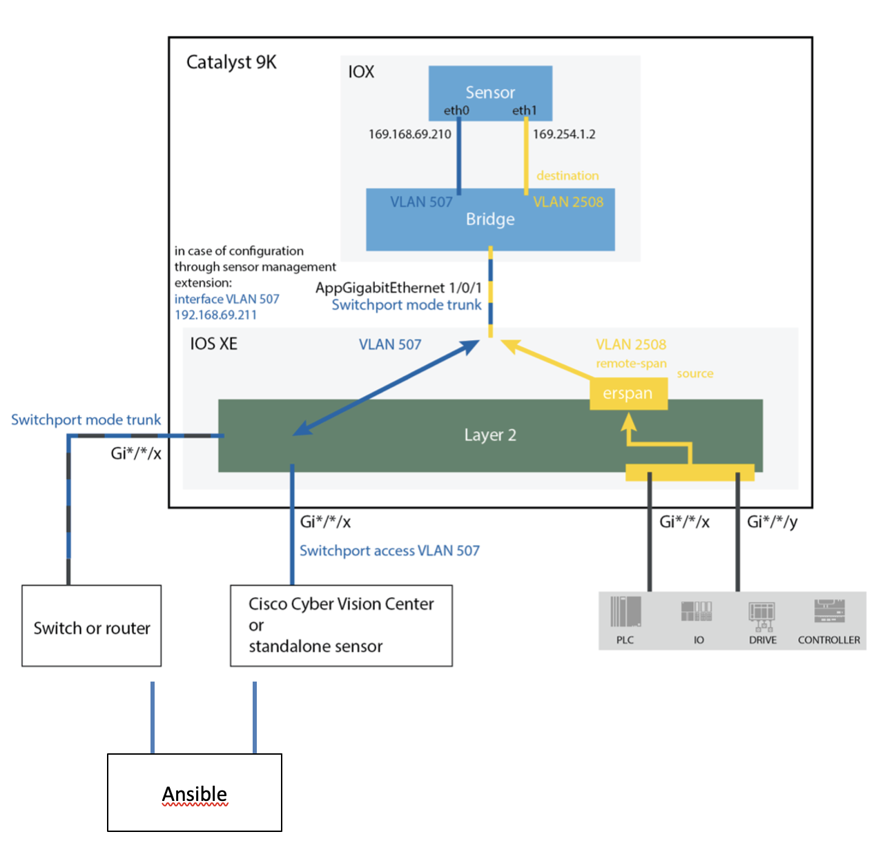
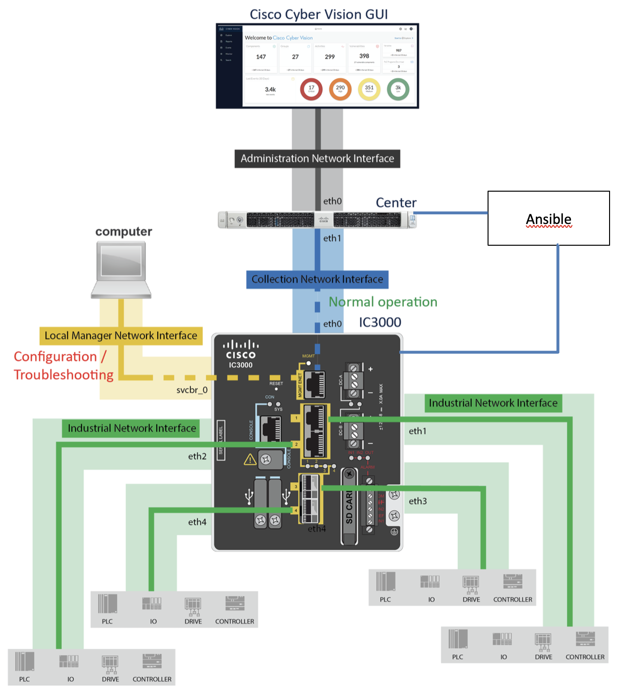
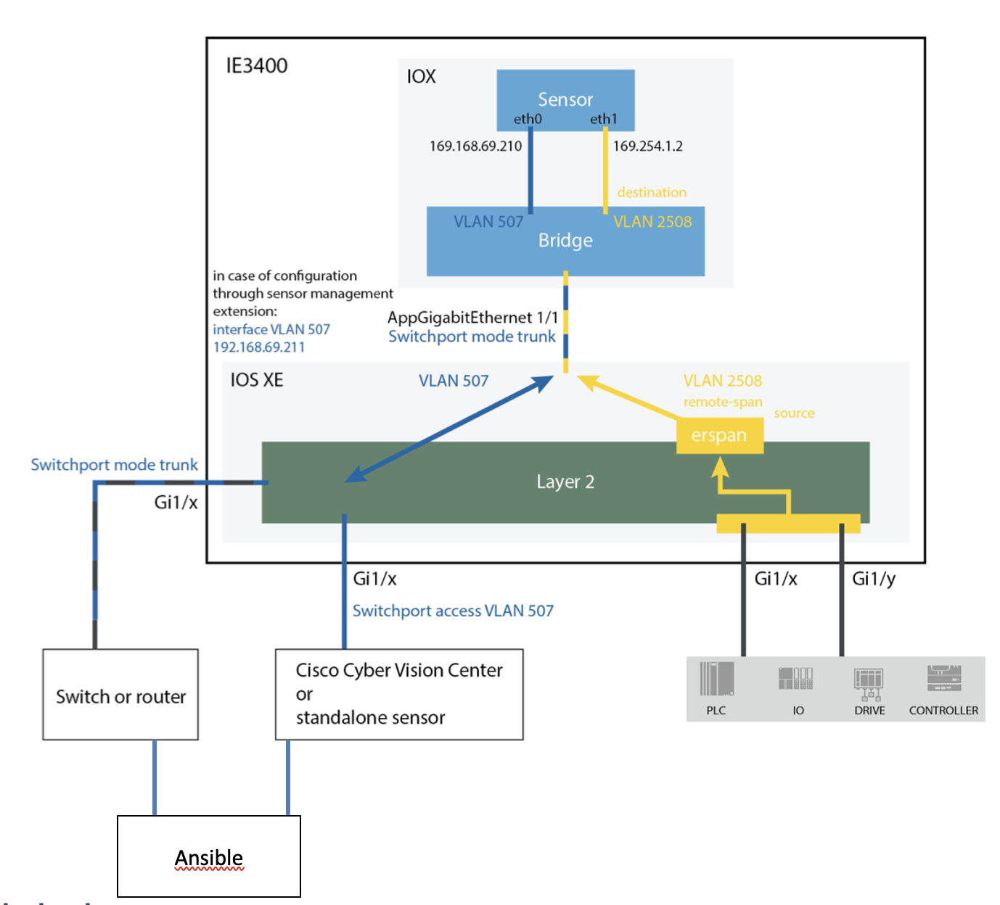
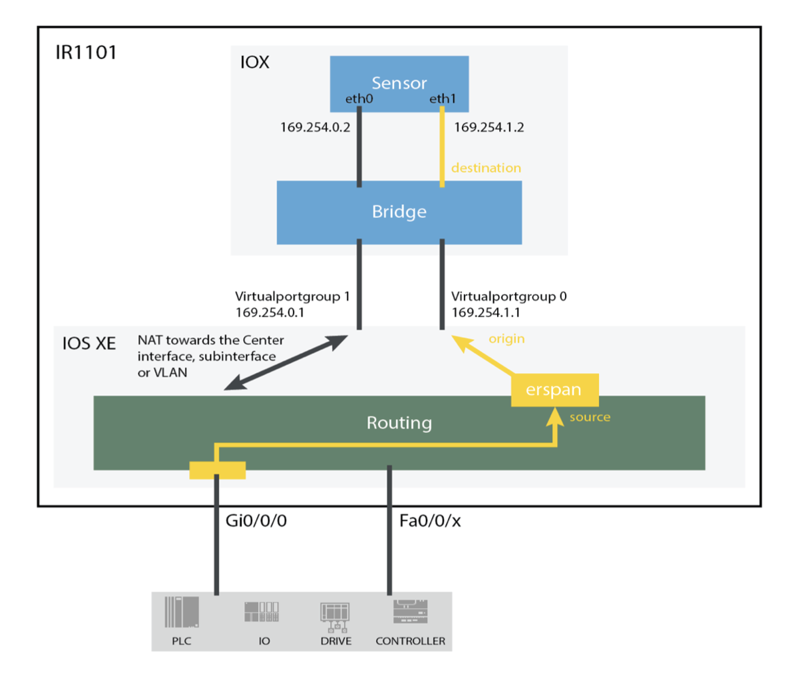
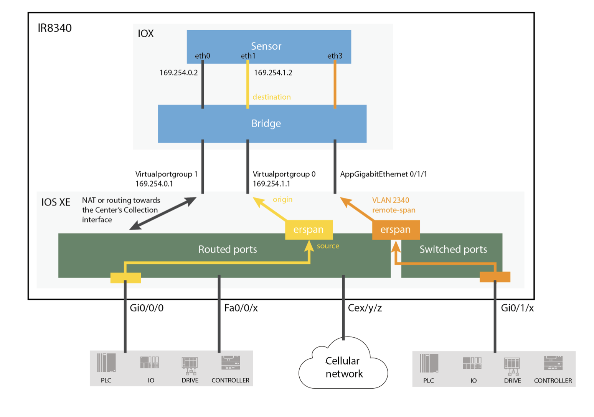

# Repository Status: Archived

**Important Notice:** This repository is maintained strictly for historical purposes. The playbooks contained here are no longer being maintained or updated. For the most up-to-date version of these playbooks, please visit the new repository [here](https://github.com/CiscoDevNet/cisco-cyber-vision-sensor-management-ansible).

We encourage all users to transition to the new repository to benefit from the latest features, improvements, and security updates.

Thank you for your understanding and cooperation.

[](https://developer.cisco.com/codeexchange/github/repo/CiscoDevNet/cisco-cyber-vision-sensor-management-ansible)

# cisco-cyber-vision-sensor-management-ansible

1	License

This project is licensed under the Cisco Sample Code License 1.1 - see the [LICENSE.md](LICENSE.md) file for details

2	Ansible Solution overview

Ansible is an open-source software provisioning, configuration management, and application-deployment tool
Ansible works by connecting to your nodes and pushing out small programs, called "Ansible modules" to them. These programs are written to be resource models of the desired state of the system. Ansible then executes these modules (over SSH by default) and removes them when finished.
Your library of modules can reside on any machine, and there are no servers, daemons, or databases required. Typically you'll work with your favorite terminal program, a text editor, and probably a version control system to keep track of changes to your content.
By default, Ansible represents what machines it manages using a very simple INI file that puts all of your managed machines in groups of your own choosing.  
To add new machines, there is no additional SSL signing server involved, so there's never any hassle deciding why a particular machine didn’t get linked up due to obscure NTP or DNS issues.
Note
More details about Ansible environment can fund on www.ansible.com


 
2.1	Perquisites 

1.	Configured Ansible environment
2.	Ansible with access to the Center Management IP (eth0)
3.	Ansible with access to Sensors Local Managers
4.	SDflash formatted in ext4 format
5.	IOx enabled on the switch
6.	No IOx application already installed on the switch

2.2	Supported Devices

•	Catalyst9X00 series. 
•	IR1101.
•	IR8340.
•	IC3K. Active Discovery is available and configurable, see below. 
•	IE3X00. Active Discovery is available and configurable, see below.

2.3	Limitations

•	Sensor IC3K upgrade
Note
The IC3K update can be done using the combined file on the UI center or sbs-update command on sensor’s CLI

3	Configuration files by device

In this section we will check the configuration files for each device, two kind of of files exist: 

•	Playbooks: contains center information (IP and token), role and sensor application path request.
•	Inventory: Contain LM information to connect and sensor configuration details. We can also choose if you will use Active discovery option

Note
On next section the inventory files will contain Discovery option for sensors which support this option, you can delete Active Discovery part if not needed
IMPORTANT 
The code on next session will be added with description for each relevant line.
The YAML file can be found on the document annex
Note
The inventory file can contain one or more switches for each described model (please see the inventory.yml file as exemple)

3.1	Catalyst 9X00 series

 

3.1.1	Playbook

<!---Sensor Type--->
hosts: catalyst9k
  gather_facts: false
  vars:
<!---Center details--->
    center_token: 
    ics-xxxxxxxxxxxxxxxxxxxxxxxxxxxxxxxxxxxxxxxx-xxxxxxxxxxxxxxxxxxxxxxxxxxxxxxxxxxxxxxxx
    center_url: https://<cyber vision center IP address>
  vars_prompt:
<!---Two next line stand for the path of the needed sensor application--->
    - name: application_tar_path
      prompt: CyberVision app path (x86-64 version)?
      private: false
<!---Role of the application--->
  roles:
    - cybervision_sensor

3.1.2	Inventory

<!---Sensor Type--->
catalyst9k:
      hosts:
<!---Local manager IP address--->
        192.168.x.x:
<!---Sensor Name--->
          name: "cat9300_1"
<!---Collection IP address configured in ETH0 on the scheme--->
          collection_address: 192.168.x.x
<!---Prefix configured in ETH0 on the scheme--->
          collection_prefix: 24
<!---Local Manager Username--->
          iox_login: <username>
<!---Local Manager password--->
          iox_password: <password>
<!---Local Manager port access--->
          iox_port: 443
          capture_mode: custom
          capture_filter: not arp
<!---This section can be deleted if we are not using Active Discovery--->
          active_discovery: true
          active_discovery_interfaces:
            - ip: "1.2.3.4"
              netmask: 24
              vlan: 14
<!---This interface is logical interface it’s mapped with the trunk AppGigabitEthernet 1/0/1 on the scheme--->
              iface: "eth2"


3.2	IC3000



3.2.1	Playbook
<!---Sensor Type--->
- hosts: ic3k
  gather_facts: false
  vars:
<!---Center details--->

    center_token: 
    ics-xxxxxxxxxxxxxxxxxxxxxxxxxxxxxxxxxxxxxxxx-xxxxxxxxxxxxxxxxxxxxxxxxxxxxxxxxxxxxxxxx
    center_url: https://<cyber vision center IP address>
  vars_prompt:
<!---Two next line stand for the path of the needed sensor application--->
    - name: application_tar_path
      prompt: CyberVision app path (ic3k version)?
      private: false
  roles:
<!---Role of the application--->
    - cybervision_sensor

3.2.2	Inventory
<!---Sensor Type--->
ic3k:
      hosts:
<!---Local manager IP address SVCBR_0 on the scheme--->
        192.168.x.x:
<!---Local manager MASK SVCBR_0 on the scheme--->
          mgmt_netmask: 255.255.255.0
<!---Local manager Gateway SVCBR_0 on the scheme--->
          mgmt_gateway: 192.168.x.x
<!---Collection IP address configured in ETH0 on the scheme--->
          collection_address: 192.168.x.x
<!---Prefix configured in ETH0 on the scheme--->
          collection_prefix: 24
<!---Local Manager Username--->
          iox_login: <username>
<!---Local Manager password--->
          iox_password: <password>
<!---Local Manager port access--->
          iox_port: 8443
          check_sensor_status: true
<!---Capture parameters--->
          capture_mode: custom
          capture_filter: not arp
<!---This section can be deleted if we are not using Active Discovery--->
          check_sensor_and_center_version: false
          active_discovery_interfaces:
            - ip: "1.2.3.4"
              netmask: 24
              vlan: 14
<!---This interface can be one of the physical interfaces of the Switch--->
              iface: "eth1"

3.3	IE3X00
 
 

3.3.1	Playbook

<!---Sensor Type--->
	- hosts: ie3X00
  gather_facts: false
  vars:
<!---Center details--->
    center_token: ics-1c09745866eccd5515b005537bf9699b1af24c96-2104c3789ca9a628508506fa029945cbc7d424e5
    ics-xxxxxxxxxxxxxxxxxxxxxxxxxxxxxxxxxxxxxxxx-xxxxxxxxxxxxxxxxxxxxxxxxxxxxxxxxxxxxxxxx
    center_url: https://<cyber vision center IP address>
  vars_prompt:
<!---Two next line stand for the path of the needed sensor application--->
    - name: application_tar_path
      prompt: CyberVision app path (aarch64 version)?
      private: false
  roles:
<!---Role of the application--->
    - cybervision_sensor

3.3.2	Inventory
<!---Sensor Type--->
ie3X00:
      hosts:
<!---Local manager IP address Interface VLAN 507 on the scheme--->
        192.168.x.x:
<!---Collection IP address configured in ETH0 on the scheme--->
          collection_address: 192.168.x.x
<!---Prefix configured in ETH0 on the scheme--->
          collection_prefix: 24
<!---Local Manager Username--->
          iox_login: <username>
<!---Local Manager Password--->
          iox_password: <password>
<!---Local Manager port access--->
          iox_port: 443
<!---Capture parameters--->
          capture_mode: custom
          capture_filter: not arp
<!---This section can be deleted if we are not using Active Discovery--->
          active_discovery: true
<!---This interface can be one of the Vlan interfaces of the switch--->
          active_discovery_interfaces:
            - ip: "1.2.3.4"
              netmask: 24
              vlan: 14
              iface: "eth2"

3.4	IR1101
 


3.4.1	Playbook

<!---Sensor Type--->
- hosts: ir1101
  gather_facts: false
  vars:
<!---Center details--->
    center_token: 
    ics-xxxxxxxxxxxxxxxxxxxxxxxxxxxxxxxxxxxxxxxx-xxxxxxxxxxxxxxxxxxxxxxxxxxxxxxxxxxxxxxxx
    center_url: https://<cyber vision center IP address>
  vars_prompt:
<!---Two next line stand for the path of the needed sensor application--->
    - name: application_tar_path
      prompt: CyberVision app path (aarch64 version)?
      private: false
  roles:
<!---Role of the application--->
    - cybervision_sensor

3.4.2	Inventory
<!---Sensor Type--->
   ir1101:
      hosts:
<!---Local manager IP address--->
        192.168.x.x:
<!---Collection IP address configured in ETH0 on the scheme--->
          collection_address: 169.254.0.2
<!---Prefix configured in ETH0 on the scheme--->
          collection_prefix: 30
<!---Local Manager Username--->
          iox_login: <username>
<!---Local Manager Password--->
          iox_password: <password>
<!---Local Manager port access--->
          iox_port: 443
          name: "sparrow_2"
	  
3.5	IR8340



3.5.1	Playbook

<!---Sensor Type--->
- hosts: ir8340
  gather_facts: false
  vars:
<!---Center details--->
    center_token: 
    ics-xxxxxxxxxxxxxxxxxxxxxxxxxxxxxxxxxxxxxxxx-xxxxxxxxxxxxxxxxxxxxxxxxxxxxxxxxxxxxxxxx
    center_url: https://<cyber vision center IP address>
  vars_prompt:
<!---Two next line stand for the path of the needed sensor application--->
    - name: application_tar_path
      prompt: CyberVision app path (aarch64 version)?
      private: false
  roles:
<!---Role of the application--->
    - cybervision_sensor

3.5.2	Inventory

<!---Sensor Type--->
   ir8340:
      hosts:
<!---Local manager IP address--->
        192.168.x.x:
<!---Collection IP address configured in ETH0 on the scheme--->
          collection_address: 169.254.0.2
<!---Prefix configured in ETH0 on the scheme--->
          collection_prefix: 30
<!---Local Manager Username--->
          iox_login: <username>
<!---Local Manager Password--->
          iox_password: <password>
<!---Local Manager port access--->
          iox_port: 443
          name: "sumatra"

3.6	IE9300


3.6.1 Playbook

<!---Sensor Type--->
- hosts: ie9300
  gather_facts: false
  vars:
<!---Center details--->
    center_token: 
    ics-xxxxxxxxxxxxxxxxxxxxxxxxxxxxxxxxxxxxxxxx-xxxxxxxxxxxxxxxxxxxxxxxxxxxxxxxxxxxxxxxx
    center_url: https://<cyber vision center IP address>
  vars_prompt:
<!---Two next line stand for the path of the needed sensor application--->
    - name: application_tar_path
      prompt: CyberVision app path (aarch64 version)?
      private: false
  roles :
<!---Role of the application--->
    - cybervision_sensor

3.6.2	Inventory

<!---Sensor Type--->
ie9300:
      hosts:
<!---Local manager IP address--->
192.168.x.x:
<!---Collection IP address configured in ETH0 on the scheme--->
          collection_address: 192.168.x.x
<!---Prefix configured in ETH0 on the scheme--->
          collection_prefix: 24
<!---Local Manager Username--->
          iox_login: <username>
<!---Local Manager Password--->
          iox_password: <password>
<!---Local Manager port access--->
          iox_port: 443
          name: "clarke_2"
<!---Capture parameters--->
          capture_mode: custom
          capture_filter: not arp
<!---This section can be deleted if we are not using Active Discovery--->
          active_discovery: true
<!---This interface can be one of the Vlan interfaces of the switch--->
          active_discovery_interfaces:
            - ip: "1.2.3.4"
              netmask: 24
              vlan: 14
              iface: "eth2"


4 Optional variables

- These variables can be set in the playbook or in the inventory file.

| Variable name                   | Comment                                                                                                                                                            |
| ------------------------------- | ------------------------------------------------------------------------------------------------------------------------------------------------------------------ |
| check_sensor_status             | Boolean. If set to true, we wait 3 min after each deployment or update, then we check connectivity status of the sensor to see if it's online. Default to ``false` |
| check_sensor_and_center_version | Boolean. If set to true, we check that center and sensor are in same version. Default to true |

- Optional common variables per host

| Variable name      | Comment |
| ------------------ | ---------------------------------------------------------------------------------------------------------------------------------------------------------------------------------- |
| collection_gateway | Gateway of collection interface. For IR1101, default value is 169.254.0.1.|
| capture_mode | Can be all, industrial_only, optimal or custom. Default: optimal. If custom, use capture_filter (see below) to configure the bpf filter. Used only in deployment (not for update). |
| capture_filter | Used only in deployment. Bpf filter used to capture trafic. Used only in deployment.|

- Optional variables per host for Cat9K, IE3X00, IE93XX and IR1101

| Variable name   | Comment                                   |
| --------------- | ----------------------------------------- |
| collection_vlan | Default value: 507. Not used for IR1101.  |
| capture_address | Default value: 169.254.1.2.               |
| capture_prefix  | Default value: 30                         |
| capture_vlan    | Default value: 2508. Not used for IR1101. |
| rspan | Default value: false. Used only for C9XXX |

5	Launch the bulk deployment process

The Playbook and the inventory details for all sensors can be added to respectively two different files, the first one can be called bulk-deployment.yml and the second inventory.yml
These two files should be added on the same folder on the ansible environment.
Another folder should be added on the same location which is  roles/cybervision_sensor folder, this one contain the role details.

it's on the zipped file : [roles.zip](roles.zip)

If a log file is needed you can activate this with adding that two vars :

1.	export ANSIBLE_LOG_PATH=~/ansible.log
2.	export ANSIBLE_DEBUG=True

After adding these different files and folders to the same folder, you can access to this one then apply this command to launch the bulk deployment:

ansible-playbook -i inventory.yml bulk-deployment.yml -f 2

Note

-f fork option will help to execute the script by batch of 2 devices each time, some steps can fail with greater batch number 

we can also use with -v option for verbose mode

ansible-playbook -v -i inventory.yml bulk-deployment.yml -f 2

See Example below for IC3K deployment using Ansible:

```
[admin@localhost home]$ ansible-playbook -i inventory.yml bulk-deployment.yml
[DEPRECATION WARNING]: Ansible will require Python 3.8 or newer on the controller starting with Ansible 2.12. Current version: 3.6.8 (default, Mar 19 2021, 05:13:41) [GCC 8.4.1 20200928 (Red Hat 8.4.1-1)]. This feature will be removed 
from ansible-core in version 2.12. Deprecation warnings can be disabled by setting deprecation_warnings=False in ansible.cfg.
No config file found; using defaults

<!---You will be prompted to add the path for the sensor extension--->
CyberVision app path?: 
<!---Then the installation will start All steps are described--->

PLAY [ic3k] ********************************************************************************************************************************************************************************************************************************

TASK [cybervision_sensor : register serial] ************************************************************************************************************************************************************************************************
ok: [10.10.10.10]

TASK [cybervision_sensor : Get Token] ******************************************************************************************************************************************************************************************************
ok: [10.10.10.10]

TASK [cybervision_sensor : register auth token] ********************************************************************************************************************************************************************************************
ok: [10.10.10.10]

TASK [cybervision_sensor : Ensure a temporary directory for app extraction] ****************************************************************************************************************************************************************
changed: [10.10.10.10]

TASK [cybervision_sensor : Extract application] ********************************************************************************************************************************************************************************************
changed: [10.10.10.10]

TASK [cybervision_sensor : Load package.yaml] **********************************************************************************************************************************************************************************************
ok: [10.10.10.10]

TASK [cybervision_sensor : Check app type (IC3K)] ******************************************************************************************************************************************************************************************
ok: [10.10.10.10] => {
    "changed": false,
    "msg": "All assertions passed"
}

TASK [cybervision_sensor : Check app type (CAT9K)] *****************************************************************************************************************************************************************************************
skipping: [10.10.10.10]

TASK [cybervision_sensor : Check app type (IR1101 and IE3X00)] *****************************************************************************************************************************************************************************
skipping: [10.10.10.10]

TASK [cybervision_sensor : Get center version] *********************************************************************************************************************************************************************************************
ok: [10.10.10.10]

TASK [cybervision_sensor : Register center version] ****************************************************************************************************************************************************************************************
ok: [10.10.10.10]

TASK [cybervision_sensor : Register center version] ****************************************************************************************************************************************************************************************
ok: [10.10.10.10]

TASK [cybervision_sensor : Register sensor version] ****************************************************************************************************************************************************************************************
ok: [10.10.10.10]

TASK [cybervision_sensor : Check center version] *******************************************************************************************************************************************************************************************
ok: [10.10.10.10] => {
    "changed": false,
    "msg": "All assertions passed"
}

TASK [cybervision_sensor : Check sensor version] *******************************************************************************************************************************************************************************************
ok: [10.10.10.10] => {
    "changed": false,
    "msg": "All assertions passed"
}

TASK [cybervision_sensor : Get the serial] *************************************************************************************************************************************************************************************************
ok: [10.10.10.10]

TASK [cybervision_sensor : Register serial] ************************************************************************************************************************************************************************************************
ok: [10.10.10.10]

TASK [cybervision_sensor : Get the app list] ***********************************************************************************************************************************************************************************************
ok: [10.10.10.10]

TASK [cybervision_sensor : detect install or update] ***************************************************************************************************************************************************************************************
ok: [10.10.10.10]

TASK [cybervision_sensor : Set app name for install] ***************************************************************************************************************************************************************************************
ok: [10.10.10.10]

TASK [cybervision_sensor : Set app name for update] ****************************************************************************************************************************************************************************************
skipping: [10.10.10.10]

TASK [cybervision_sensor : Get the disk size] **********************************************************************************************************************************************************************************************
skipping: [10.10.10.10]

TASK [cybervision_sensor : Register disk size (IC3k)] **************************************************************************************************************************************************************************************
ok: [10.10.10.10.]

TASK [cybervision_sensor : Register available disk size (Cat9k or IE3k)] *******************************************************************************************************************************************************************
skipping: [10.10.10.10]

TASK [cybervision_sensor : Calculate reserved disk size (Cat9k or IE3k)] *******************************************************************************************************************************************************************
skipping: [10.10.10.10]

TASK [cybervision_sensor : Calculate allocation disk size (Cat9k or IE3k)] *****************************************************************************************************************************************************************
skipping: [10.10.10.10]

TASK [cybervision_sensor : Retrieve allocated disk size (cat9k or IE3k)] *******************************************************************************************************************************************************************
skipping: [10.10.10.10]

TASK [cybervision_sensor : Register allocated disk size (Cat9k or IE3k)] *******************************************************************************************************************************************************************
skipping: [10.10.10.10]

TASK [cybervision_sensor : Get app status] *************************************************************************************************************************************************************************************************
skipping: [10.10.10.10]

TASK [cybervision_sensor : Check if sensor exists] *****************************************************************************************************************************************************************************************
ok: [10.10.10.10]

TASK [cybervision_sensor : get sensor id] **************************************************************************************************************************************************************************************************
ok: [10.10.10.10]

TASK [cybervision_sensor : default value for sensor id] ************************************************************************************************************************************************************************************
ok: [10.10.10.10]

TASK [cybervision_sensor : Install app] ****************************************************************************************************************************************************************************************************
ok: [10.10.10.10]

TASK [cybervision_sensor : Unsupported update on IC3K] *************************************************************************************************************************************************************************************
skipping: [10.10.10.10]

TASK [cybervision_sensor : Stop app] *******************************************************************************************************************************************************************************************************
skipping: [10.10.10.10]

TASK [cybervision_sensor : Get the app status] *********************************************************************************************************************************************************************************************
skipping: [10.10.10.10]

TASK [cybervision_sensor : Get app status] *************************************************************************************************************************************************************************************************
skipping: [10.10.10.10]

TASK [cybervision_sensor : Deactivate app] *************************************************************************************************************************************************************************************************
skipping: [10.10.10.10]

TASK [cybervision_sensor : Upgrade app] ****************************************************************************************************************************************************************************************************
skipping: [10.10.10.10]

TASK [cybervision_sensor : template name for activation payload (ic3k)] ********************************************************************************************************************************************************************
ok: [10.10.10.10]

TASK [cybervision_sensor : template name for activation payload (ir1101)] ******************************************************************************************************************************************************************
skipping: [10.10.10.10]

TASK [cybervision_sensor : template name for activation payload (catalyst9k)] **************************************************************************************************************************************************************
skipping: [10.10.10.10]

TASK [cybervision_sensor : template name for activation payload (ie3X00)] ******************************************************************************************************************************************************************
skipping: [10.10.10.10]

TASK [cybervision_sensor : Assert that we found an activation payload template] ************************************************************************************************************************************************************
ok: [10.10.10.10] => {
    "changed": false,
    "msg": "All assertions passed"
}

TASK [cybervision_sensor : Activate app] ***************************************************************************************************************************************************************************************************
ok: [10.10.10.10]

TASK [cybervision_sensor : Start app] ******************************************************************************************************************************************************************************************************
ok: [10.10.10.10]

TASK [cybervision_sensor : Check if sensor exists] *****************************************************************************************************************************************************************************************
ok: [10.10.10.10]

TASK [cybervision_sensor : get sensor id] **************************************************************************************************************************************************************************************************
ok: [10.10.10.10]

TASK [cybervision_sensor : default value for sensor id] ************************************************************************************************************************************************************************************
ok: [10.10.10.10]

TASK [cybervision_sensor : Check sensor status] ********************************************************************************************************************************************************************************************
ok: [10.10.10.10]

TASK [cybervision_sensor : get enrollment status] ******************************************************************************************************************************************************************************************
ok: [10.10.10.10]

TASK [cybervision_sensor : Ensure a temporary directory for sensor provisioning download.] *************************************************************************************************************************************************
changed: [10.10.10.10]

TASK [cybervision_sensor : Set sensor name used in Center] *********************************************************************************************************************************************************************************
ok: [10.10.10.10]

TASK [cybervision_sensor : Create sensor] **************************************************************************************************************************************************************************************************
skipping: [10.10.10.10]

TASK [cybervision_sensor : register sensor id] *********************************************************************************************************************************************************************************************
skipping: [10.10.10.10]

TASK [cybervision_sensor : Get sensor provisioning] ****************************************************************************************************************************************************************************************
skipping: [10.10.10.10]

TASK [cybervision_sensor : Upload provisioning package] ************************************************************************************************************************************************************************************
skipping: [10.10.10.10]

TASK [cybervision_sensor : Create sensor] **************************************************************************************************************************************************************************************************
ok: [10.10.10.10]

TASK [cybervision_sensor : register sensor id] *********************************************************************************************************************************************************************************************
ok: [10.10.10.10]

TASK [cybervision_sensor : Get sensor provisioning] ****************************************************************************************************************************************************************************************
changed: [10.10.10.10]

TASK [cybervision_sensor : Extract provisioning package] ***********************************************************************************************************************************************************************************
changed: [10.10.10.10]

TASK [cybervision_sensor : Upload provisioning package] ************************************************************************************************************************************************************************************
ok: [10.10.10.10]

TASK [cybervision_sensor : Stop app] *******************************************************************************************************************************************************************************************************
ok: [10.10.10.10]

TASK [cybervision_sensor : Start app] ******************************************************************************************************************************************************************************************************
ok: [10.10.10.10]

TASK [cybervision_sensor : Pause for 3 minutes to wait for app restart & center connectivity] **********************************************************************************************************************************************
skipping: [10.10.10.10]

TASK [cybervision_sensor : Check sensor status] ********************************************************************************************************************************************************************************************
skipping: [10.10.10.10]

TASK [cybervision_sensor : get sensor status] **********************************************************************************************************************************************************************************************
ok: [10.10.10.10]

TASK [cybervision_sensor : Check sensor is connected] **************************************************************************************************************************************************************************************
skipping: [10.10.10.10]
```
